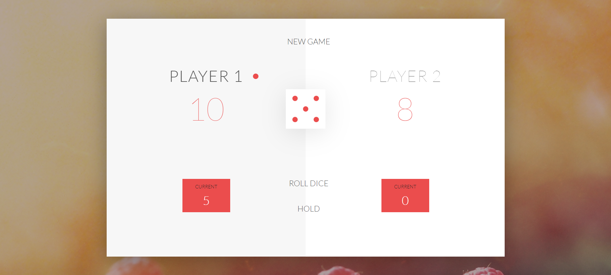

<div align="center">
<h1 align="center">

<br>PIG GAME</h1>
<h3>Developed with the software and tools below</h3>
<h3>HTML, CSS, JavaScript</h3>
<p align="center">


</p>


</div>

---
## Description
PIG GAME is a simple, two-player dice game developed during the 2nd year of my bachelor’s degree. The game involves two buttons: "ROLL DICE" and "HOLD". Players take turns rolling the dice. A player can roll the dice multiple times, but if they roll a 1, they lose their turn and all points for that round. Players can hold to save their score and pass the turn to the next player.

## How to Install or Run
To run the game, follow these steps:
1. Download or clone the repository to your computer:
    ```bash
    git clone https://github.com/Abu-Taher-web/PIG-GAME.git
    ```
2. Open the `index.html` file in a web browser to play the game.

## UI


## Technologies Used
- HTML
- CSS
- JavaScript

## Contributing
No contributions are required for this project.

## License
MIT
